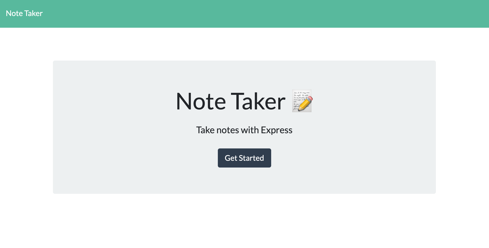
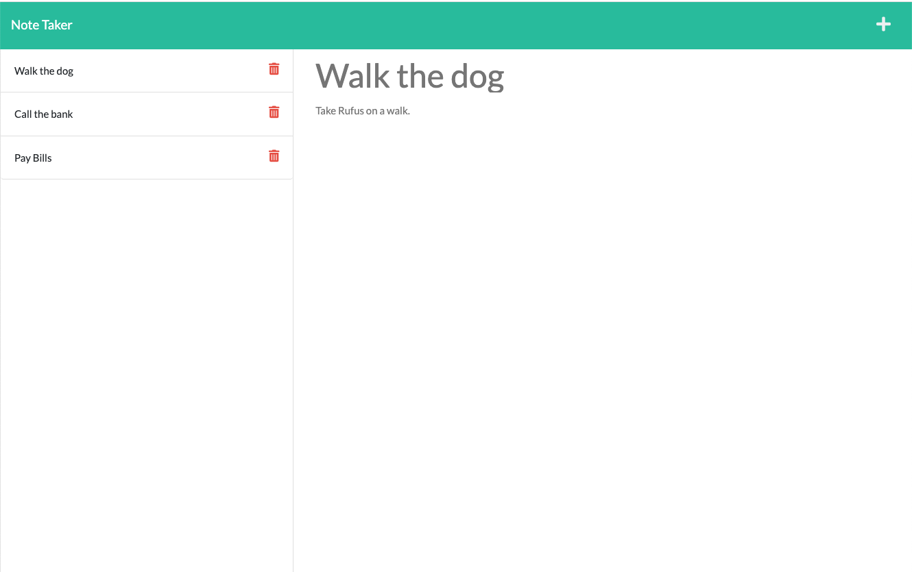

# Note-Taker

## Description

* The repository shows an application called Note-Taker that can be used to write and save notes. This application uses an Express.js back end and saves and retrieves note data from a JSON file.

## Functionality

* The application has been deployed to Heroku at the link: https://c-alan-note-taker.herokuapp.com/  

* When the application is opened to the url for the home page, there is an option to click on:  "Get Started".  Upon clicking on "Get Stated" a page is opened showing the entered notes.  I can select the plus sign on the top right to create a new note with a title and note text.  Empty fields are show where I can enter the title and note text.  After I have added the note a save icon appears.  When I click the save icon the note is saved on the left-hand column with other existing notes.  When I click on and existing note in the list in the left-hand column the note appears in the right-hand column.

## Code

* The application uses Express.js for the backend and a JSON file where notes data is saved and retrieved.  There are HTML routes for GET notes and POST notes.  Notes are stored with unique ID's in the JSON file.

* The project contains a "public" folder which contains a subfolder for the CSS, which contains a style.css file, and a subfolder for the JS, which contains an index.js file.  The project uses Bootstrap with links shown on the head section of the HTML.  There is also linked CSS stylesheet in the head section of the HTML. 

* The HTML code contains a logical structure for the elements within the page.  There are sections within the body showing how the first page looks.

* Comments have been applied to the different files in the code to identify each section of code. 

* There is server.js file which serves as the start point for application

* Included is a package.json file with the required dependencies, as well as gitignore, node_modules and .DS_Store files.

## Installation

* The code for this project can be found on GitHub at: https://github.com/c-alanwill/note-taker

* The deployed app is available at: https://c-alan-note-taker.herokuapp.com/

## Usage

The following image demonstrates the web application's appearance and functionality:

## Credits

N/A

## License

Please refer to the license in the repo.

## Contributing

N/A